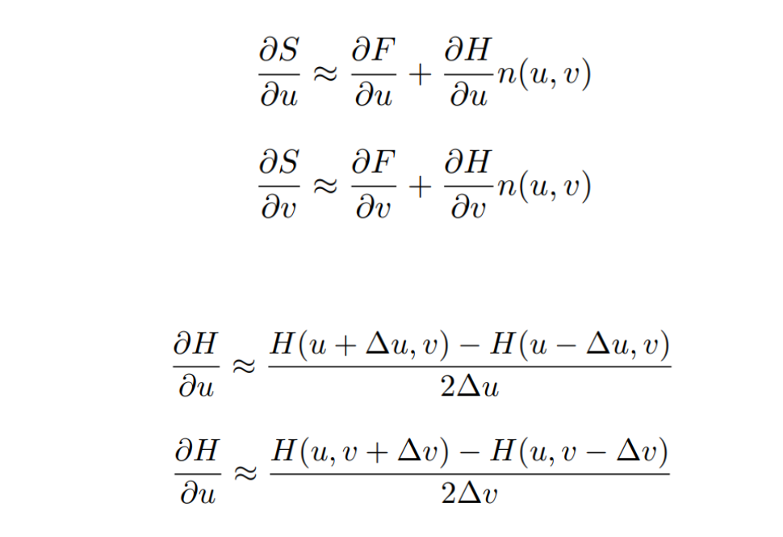
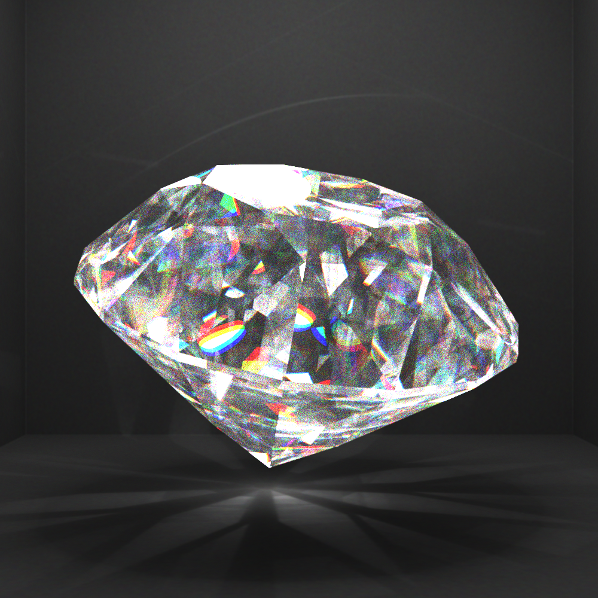

# 基于sppm的图像渲染引擎

> 2022 Graphics THU 

## 实现功能
  - **SPPM**：stochastic progressive photon mapping
  - **求交加速**：KDTree,OpenMP,AABB
  - **抗锯齿**
  - **景深**: depth of field
  - **软阴影**：SPPM 自带效果
  - **贴图**：纹理贴图，凹凸贴图
  - **复杂网格模型**
  - **色散**：参数曲面色散

****

## 实现细节

### SPPM

*SPPM*算法的逻辑为：首先依据相机视线进行**蒙特卡洛采样**（选取散射，折射或者反射的概率由材质决定）*visible points*，并且将这些点存储到 *KD Tree* 的结构中。然后各个光源随机发射光子，同样按照材质 *type* 不同，选择不同概率进行反射，折射，或者就停留在当前位置。最后得到光子的停留位置后，通过前面建立的 *visible points* 的 *kd tree* 来查询能够吸收当前光子的 *visible points*（距离小于某一阈值则视为可以被吸收），据此更新这些 *visible points* 的光通量。最后进行一次平均，得最后结果。

### 求交加速

#### AABB包围盒

所有的物体都在建立的时候确认了其 **AABB bounding box** 的最大坐标值和最小坐标数值，分别用 max 和 min 来表示。这样，在计算的时候可以直接通过 AABB bounding box 实现比较简单的判定。比如可以利用光线和三组平行平面相交的位置是否有交来快速判定是否存在交点。除此之外，Hit Point 感光可能性的快速判定等其他功能也可以借助这个结构实现。

#### HitPoints 快速求解及与光线求交

ObjectTree 为了加速已知相机或者光线视角之后，求解与物体的交点。首先对所有物体进行预处理，利用一个类似于 **KD Tree** 和 **Segment Tree** 结合体的树结构存储所有的物体。这个 Tree的结构和 KD Tree 有所不同，对于整体空间，利用空间在某个维度 (x 或者 y 或者 z) 的中间平面进行分割，被分进两个块的物体分别隶属于左右子树，而能够横跨这个中间平面的物体隶属于父节点。（注：建树过程中，为了简化运算，把物体直接视作 AABB bounding box 来建树）这样的组织参考开源代码。对于复杂的网格模型，为了加速与其求交的计算，最开始读入网格的时候就会把三角面片处理成为这样的树的结构，然后再把其作为一个物体插入总树中。最后求交的时候，由于建树是基于 bounding box 的，所以可以先根据子树的 Bounding Box 的情况进行快速判定，剪枝，然后再对于有相交可能性的 object 进行探索。

#### openMP

求解 hitpoints 和送光的循环都利用了 OpenMP，利用**多线程**来加速求解

### 抗锯齿
直接在求视线的时候，对视线的屏幕坐标位置加了一个-1 到 1 的干扰这样，在不停的迭代过程中，相机的某一个像素点就会是周围一部分点的**平均色彩**，就可以达到抗锯齿的作用。

### 景深
景深的原理是：对视线加一个光圈。从原来的对于每一个像素点固定视线，变成，对这个像素点的视线施加光圈大小的干扰。虽然光圈本应该实现为一个圆形，但是实验发现，直接实现成矩形区域的扰动对效果没有影响，而且速度更快（不用计算 cos 和 sin），所以最后选择实现为矩形的扰动。

### 贴图

#### 纹理贴图

纹理贴图的实现的本质三维曲面到二维曲面的映射。球面，平面和参数曲面的 uv 坐标求解是程序计算的，而复杂曲面是则利用其自带的 uv 坐标参数。在渲染中获取表面颜色的时候，如果物体带有纹理，就会直接获取对应 uv 坐标的 texture 文件的颜色。获取了 uv 坐标之后，在加载纹理 RGB 颜色数值的方式是通过双线性插值的方式，对于临近的像素点色彩进行插值得出的。

#### 凹凸贴图
凹凸贴图的本质是对曲面在法向进行扰动，查询开源资料发现，有一种对于法向向更新量值的简单求解方法：首先假设原来的曲面方程是 F(u, v)，bump file 引入的高度变化是：H(u, v). 而u,v处的法向量是：n(u,v)

$$S(u, v) = F(u, v) + H(u, n)n(u, v)$$
于是有：

之后再把 S 的两个偏导数相叉积，就可以得到更新后的法向量。

### 复杂网格模型

复杂网格模型的求交本质就是三角形的求交。按照加速小节所说，求交之前会提前处理出一个特殊的树结构用于加速求交。为了防止渲染出的曲面不连续，对于求得的交点需要进行重心插值，得到点 P 的重心坐标作为权重，对三个顶点进行加权平均，进而得到最终的法向量或者是 uv 坐标值。

### 参数曲面
解析法（**牛顿法**）求解

### 色散
色散的实现思路是利用**三个不同的折射率**（红色，绿色和蓝色的折射率）**分别渲染**出三幅图，然后把三张图片的 RGB 三个通道分别取出，重新组合，得到最后的图片。

****

## 效果预览

